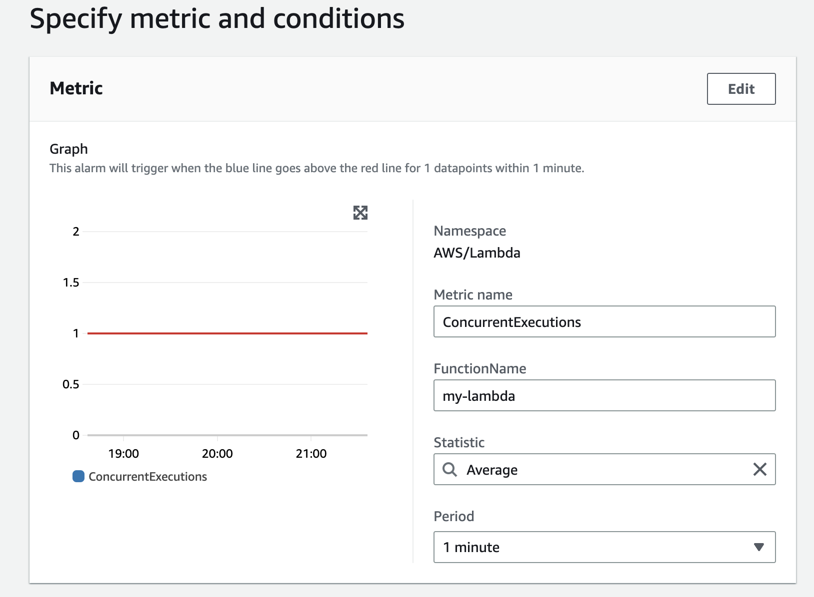
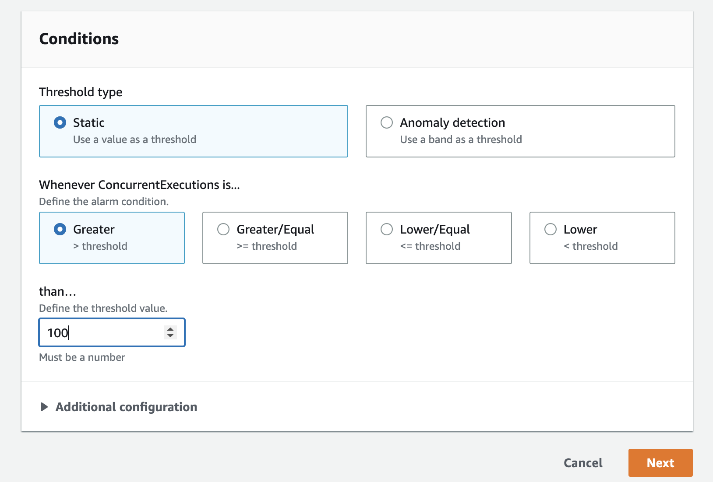
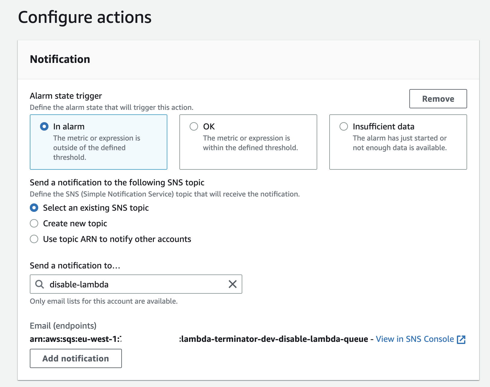
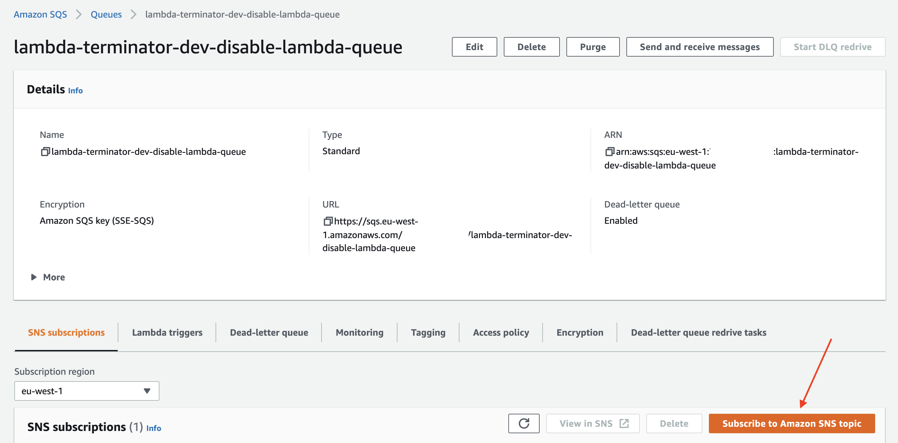
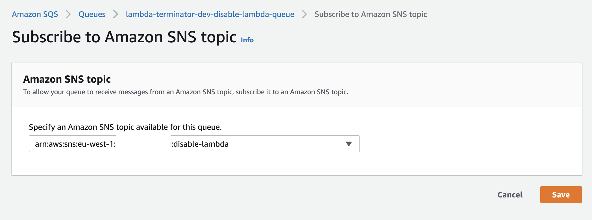
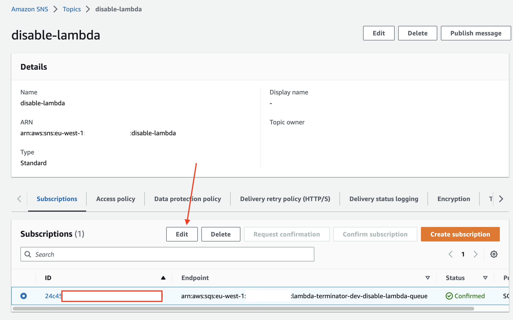
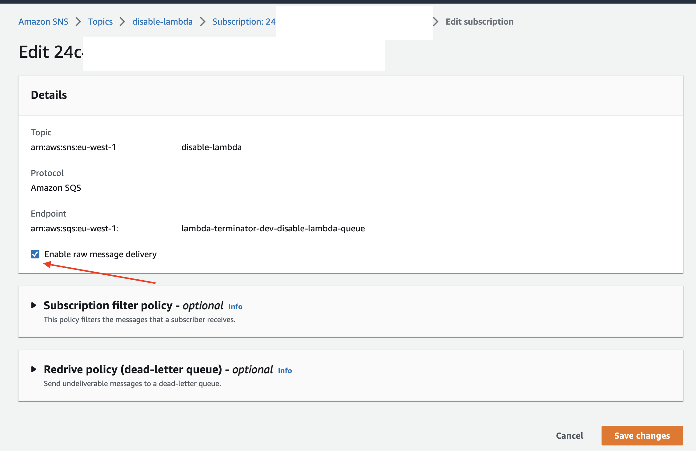

lambda-terminator is a lambda function for throttling other lambdas. useful to automate CloudWatch alarm actions.

# Requirements

Create a deployment bucket where all the serverless deployments will be uploaded.
The bucket name should be `serverless-deployments-${aws:accountId}` where `${aws:accountId}` is the AWS account number.

# Deploying

```
serverless deploy
```

# Removing

```
serverless remove
```


# Usage

1. Create a new CloudWatch alarm and select the metric (usually this is `ConcurrentExecutions` of the target lambda)


2. Select the alarm threshold at which the target lamdba will be disabled.


3. Configure alarm to send notification to SNS topic (e.g. `disable-lambda`).


4. Subscribe the terminator lambda queue to the SNS topic of the alarm.




5. Change the subscription and enable raw delivery.


